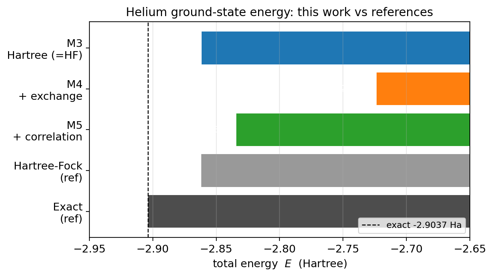
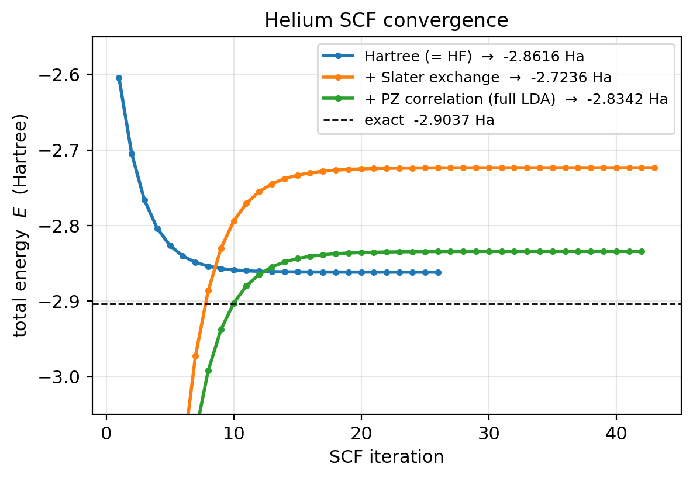
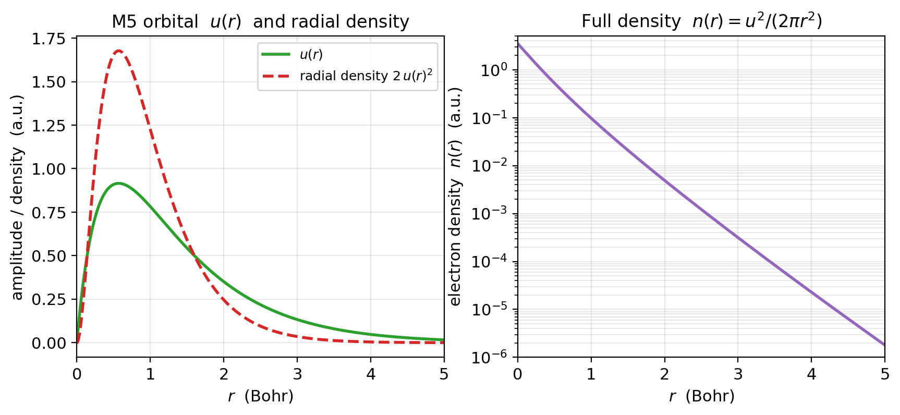
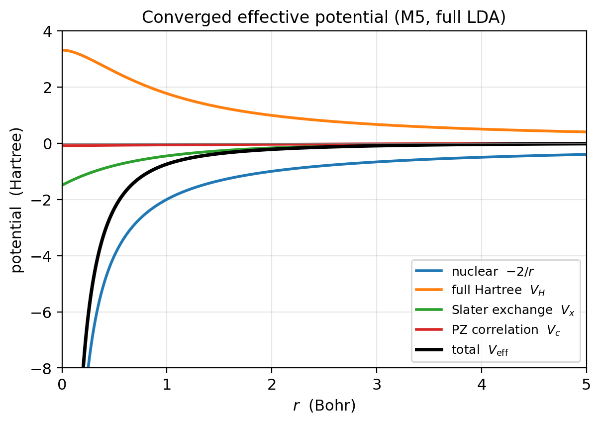

# DFT Ground-State Energy of the Helium Atom

A from-scratch **density-functional theory (DFT)** calculation of the helium
ground-state energy in Python, using only `numpy` and `matplotlib`. Every
numerical method — the radial Schrödinger solver, the Poisson solver for the
Hartree potential, the self-consistent-field (SCF) loop, and the
exchange–correlation functionals — is **hand-written and commented**, so each
line can be explained rather than treated as a black box.

Starting from nothing but the nuclear charge, the program climbs the standard
ladder of approximations and reaches the local-density-approximation (LDA)
answer of **−2.83 Ha**, against an exact value of **−2.90 Ha**.

All quantities are in **atomic units** ($\hbar = m_e = e = 4\pi\varepsilon_0 = 1$):
length in Bohr, energy in Hartree (Ha).

---

## Headline results

| Approximation | This work (Ha) | Reference (Ha) | Error vs exact |
|---|---:|---:|---:|
| Self-consistent Hartree (≡ restricted Hartree–Fock) | **−2.8616** | −2.86 | 0.042 |
| + Slater LDA exchange | **−2.7236** | −2.72 | 0.180 |
| + Perdew–Zunger correlation (**full LDA**) | **−2.8342** | −2.83 | 0.070 |
| Hartree–Fock (reference) | — | −2.8617 | 0.042 |
| Exact / experiment | — | −2.9037 | — |

Warm-up checks (single electron, bare nucleus, no electron–electron term):

| Check | This work (Ha) | Exact |
|---|---:|---:|
| Hydrogen 1s ($Z=1$) | −0.499996 | −0.5 |
| He⁺ 1s ($Z=2$) | −1.999937 | −2.0 ($-Z^2/2$) |



---

## The physics, in one paragraph

With one electron, an atom is solvable by hand. With two, the electrons repel
each other, and the mutual repulsion makes the problem analytically unsolvable.
DFT sidesteps this by tracking the **electron density** $n(\mathbf r)$ instead of
the individual electrons: the energy is written as a functional of that density.
The catch is circular — the potential each electron feels depends on where the
other electron is, but where the electrons sit depends on the potential — so we
**guess, solve, update, and repeat until nothing changes** (self-consistency).
Each piece of physics added (electron repulsion → exchange → correlation) moves
the energy closer to the truth.

---

## Method: the build, one layer at a time

The radial Schrödinger equation for the spherically symmetric 1s state, with
$u(r) = r\,R(r)$ and normalisation $\int_0^\infty u^2\,dr = 1$:

$$ u''(r) = 2\,[\,V(r) - E\,]\,u(r) $$

**1. Hydrogen-like radial solver (the core engine).**
$V(r) = -Z/r$ is integrated **inward** from $r_{\max}$ with the **Numerov**
scheme; a **bisection** root finder varies $E$ until the bound-state condition
$u(0)=0$ is met. Validated against hydrogen ($-0.5$ Ha, $u = 2r e^{-r}$) and
He⁺ ($-2.0$ Ha).

**2. Hartree potential (electron-cloud repulsion).**
The electrostatic repulsion of the cloud, $V_H$, is obtained by solving the
radial **Poisson** equation for $U(r) = r\,V_H(r)$:

$$ U''(r) = -\frac{u(r)^2}{r}, \qquad U(0)=0,\quad U(r_{\max}) = q_{\max} $$

Validated against the exact hydrogen result $U(r) = -(r+1)e^{-2r}+1$.

**3. Self-consistent Hartree (≡ Hartree–Fock for the helium singlet).**
The SCF loop solves $V(r) = -2/r + V_H(r)$ with the self-interaction-removed
Hartree, mixing the potential ($w\approx0.3$) until the eigenvalue converges.
Energy: $E = 2\varepsilon - \int V_H\,u^2\,dr$. **→ −2.8616 Ha.**

> This equals **restricted Hartree–Fock** (−2.86), and that is *correct*: for a
> two-electron closed-shell singlet the self-interaction-removed Hartree
> potential coincides exactly with the RHF potential, because HF exchange only
> cancels the self-interaction — with one occupied orbital, $(2J-K)\phi = J\phi$.

**4. LDA with Slater exchange.**
Switch to the full two-electron density $n = u^2/(2\pi r^2)$ and the full
Hartree, then add the Slater exchange potential
$V_x = -\left(3u^2/2\pi^2 r^2\right)^{1/3}$. **→ −2.7236 Ha.** Less bound than
HF because LDA exchange is only an *approximate*, averaged exchange and removes
the self-interaction only approximately.

**5. Full LDA: + Perdew–Zunger correlation.**
Add the Ceperley–Alder correlation in the Perdew–Zunger parametrisation, a
function of the Wigner–Seitz radius $r_s = (3/4\pi n)^{1/3}$ with the two regimes
$r_s \ge 1$ and $r_s < 1$ handled separately. **→ −2.8342 Ha** — the headline
LDA result, 0.07 Ha from exact.

---

## Figures

**SCF convergence** — the three models converging; note that adding LDA exchange
(orange) is *less* bound than Hartree/HF (blue), and correlation (green) pulls
it back down:



**Converged orbital and electron density** (full LDA):



**The effective potential and its pieces** — the deep nuclear $-2/r$ well, the
repulsive full Hartree, and the small attractive exchange and correlation
corrections:



---

## Repository layout

```
dft-helium/
├── dft.py             # the physics engine (grid, integrator, Numerov solver,
│                      #   root finder, Poisson solver, the three SCF variants)
├── helium_dft.ipynb   # narrative notebook: explanation + demos + plots
├── tests/
│   └── test_dft.py    # one pytest test per validation target
└── figures/           # publication figures (PNG + PDF) and the results table
    ├── fig1_scf_convergence.{png,pdf}
    ├── fig2_orbital_density.{png,pdf}
    ├── fig3_potentials.{png,pdf}
    ├── fig4_energy_comparison.{png,pdf}
    └── results_table.{csv,tex}
```

The validated physics lives in `dft.py`; the notebook and the tests import the
**same** code, so what you read in the notebook is exactly what is tested.

---

## Getting started

Requirements: Python 3, `numpy`, `matplotlib` (plus `pytest` and `jupyter` to
run the tests and the notebook).

```bash
pip install numpy matplotlib pytest jupyter
```

**Reproduce the numbers (fast):**

```python
import dft
r = dft.make_grid()                 # uniform radial grid, h=0.001, r_max=25 Bohr
print(dft.scf_no_xc(Z=2.0, r=r, verbose=False)["E"])   # -2.8616  (Hartree = HF)
print(dft.scf_lda_x (Z=2.0, r=r, verbose=False)["E"])  # -2.7236  (+ Slater exchange)
print(dft.scf_lda_xc(Z=2.0, r=r, verbose=False)["E"])  # -2.8342  (full LDA)
```

**Run the notebook** top to bottom for the full narrative, all checks, and the
figures:

```bash
jupyter nbconvert --to notebook --execute --inplace helium_dft.ipynb
```

---

## Validation

Every stage has a test mirroring its target; run `pytest -v`:

| Test | Asserts |
|---|---|
| `test_integrator_known_value` | the Simpson integrator reproduces $\int e^{-r} = 1$ |
| `test_hydrogen_ground_state_energy` | $Z=1 \Rightarrow E = -0.5$ Ha |
| `test_hydrogen_ground_state_wavefunction` | $u(r) \approx 2r e^{-r}$ |
| `test_helium_bare_nucleus_energy` | $Z=2 \Rightarrow E = -2.0$ Ha |
| `test_hartree_potential_hydrogen_analytic` | $U(r) = -(r+1)e^{-2r}+1$ |
| `test_scf_hartree_equals_hf` | self-consistent Hartree $= -2.86$ Ha |
| `test_scf_lda_slater_exchange_energy` | + Slater exchange $= -2.72$ Ha |
| `test_scf_full_lda_energy` | full LDA $= -2.83$ Ha |

All 8 pass (tolerance ~$10^{-2}$ Ha on the SCF energies, ~$10^{-3}$ on the
checks).

---

## Numerical details

- **Grid:** uniform, $r = h, 2h, \dots, r_{\max}$ with $h = 0.001$ Bohr and
  $r_{\max} = 25$ Bohr (25,000 points). The grid starts at $r=h$, not $0$, to
  avoid the $1/r$ singularity. The fine step is needed to resolve the steep
  $e^{-2r}$ cusp of the $Z=2$ orbital.
- **Integration:** composite Simpson's rule.
- **Eigenvalue search:** scan for the lowest sign change of the extrapolated
  $u(0)$, then bisect; the SCF loops warm-start the search at the previous
  eigenvalue.
- **SCF:** linear potential mixing with $w = 0.3$; the exchange/correlation runs
  ramp the interaction in from zero for a stable start.

---

## References

- W. Kohn, L. J. Sham, *Self-Consistent Equations Including Exchange and
  Correlation Effects*, Phys. Rev. **140**, A1133 (1965).
- D. M. Ceperley, B. J. Alder, Phys. Rev. Lett. **45**, 566 (1980).
- J. P. Perdew, A. Zunger, *Self-interaction correction to density-functional
  approximations*, Phys. Rev. B **23**, 5048 (1981).
